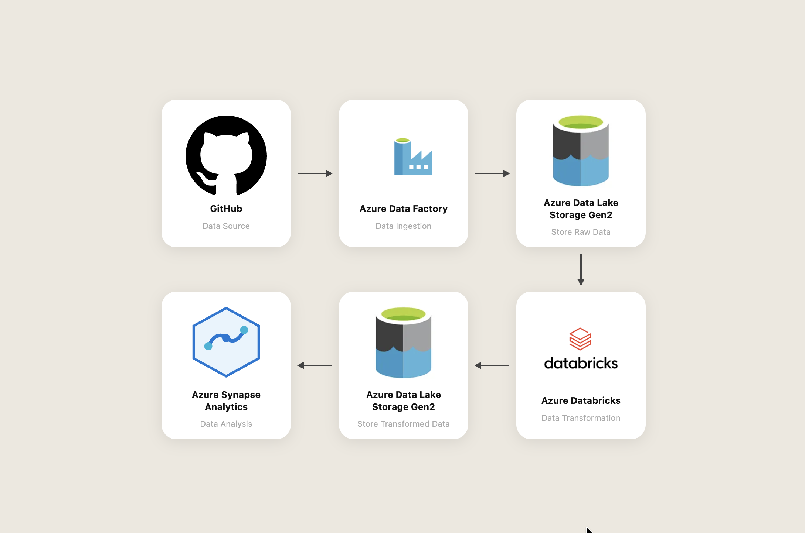

# FIFA 22 Azure Data Engineering Pipeline


## 📌 Overview

As part of my learning journey in cloud data engineering, I built this project to get real hands-on experience with Azure services. I wanted to understand how data moves through a cloud pipeline, how it gets transformed at scale, and how it becomes queryable insights.

This project taught me how modern data engineering works in practice. from ingesting raw files and transforming them with PySpark, to querying them directly from a Data Lake using Serverless SQL. Every step had its own challenges, and working through them gave me a much deeper understanding of cloud-native data architecture than any course could.

## 📂 Dataset

I worked with the FIFA 22 Complete Player Dataset (sourced from Kaggle), covering FIFA 15 through FIFA 22 seasons, hosted on my GitHub repository.


## 🏗️ Pipeline Architecture



## 🚀 Data Pipeline Workflow

**Data Ingestion**

Used Azure Data Factory to build a pipeline, ingesting raw CSV files from GitHub into Azure Data Lake Storage Gen2 (ADLS Gen2). Configured HTTP linked services and binary copy mode to handle the raw files efficiently — fully automated with no manual downloads.

**Raw Storage**

Stored all raw CSV files in a dedicated raw container in ADLS Gen2. Keeping raw and transformed data in separate containers follows the Medallion architecture pattern, ensuring data clarity and reusability throughout the pipeline.

**Data Transformation**

Leveraged PySpark in Azure Databricks to read all raw CSV files from ADLS Gen2. Used storage account key authentication via spark.conf.set to securely connect Databricks to the Data Lake. Combined all 8 seasons into one unified dataset using unionByName which handles schema differences across seasons gracefully and wrote the output as Parquet files into the transformed container. Parquet format was chosen for its columnar storage, compression efficiency, and fast query performance.

**Transformed Storage**

Wrote the cleaned and unified dataset back into a separate transformed container in ADLS Gen2 as Parquet files, making the data ready for downstream analytics without any further processing.

**Analytics**

Used Azure Synapse Analytics (Serverless SQL Pool) to run SQL queries directly on the Parquet files sitting in ADLS Gen2 with no data movement or loading required. Used OPENROWSET to query the Parquet files and created a database view for structured access. Ran SQL queries to uncover insights like top-rated players, most represented nationalities, highest-valued players, and best young talents under 21.

## 🛠️ Azure Services Used

| Service | Purpose |
|---|---|
| Azure Data Factory | Automated data ingestion from GitHub to ADLS Gen2 |
| Azure Data Lake Storage Gen2 | Stores both raw and transformed data |
| Azure Databricks | PySpark transformation across all 8 seasons |
| Azure Synapse Analytics | Serverless SQL queries on transformed Parquet files |

## 📁 Repository Structure

```
fifa22_azure_project/
├── data/raw/                        # Raw CSV files (FIFA 15–22)
├── scripts/
│   ├── fifa22_transformation.ipynb  # PySpark transformation notebook
│   └── sql_queries.sql              # Synapse SQL queries
├── DataPipelineFlowchart.png
└── README.md
```

## 💻 Tech Stack

`Python` · `PySpark` · `SQL` · `Parquet` · `Azure Data Factory` · `Azure Data Lake Storage Gen2` · `Azure Databricks` · `Azure Synapse Analytics`
